# Event Management App
[**Deck Board**](https://github.com/hoss-java/EventManagementApp/blob/main/DECK.md)

## An introduction and overview

### A summery all have been done until now

* Java
>> * Things that have been done
>> * Investigation about some Java frameworks to have a better image about the area that is working on [Java frameworks](https://github.com/hoss-java/lessons/blob/main/w48-java1/java_frameworks_spike.md)
>> * Code and develop java standalone classes, and run them via cli [Raw java](https://github.com/hoss-java/calapp-workshop/tree/main/rawjava)
>> * Create maven projects and coding classes as a part of a maven project [Maven project](https://github.com/hoss-java/calapp-workshop/tree/main/CalApp)
>> * Create libraries and helper classes [Librery and helper class](https://github.com/hoss-java/calapp-workshop/blob/main/CalApp/src/main/java/com/CalApp/lib/ExpressionParser.java)
>> * Using libraries and helper classes [Using library](https://github.com/hoss-java/calapp-workshop/blob/main/CalApp/src/main/java/com/CalApp/CalApp.java)
>> * Develop unit tests for methods using classic Junit [Using classic Junit](https://github.com/hoss-java/calapp-workshop/blob/main/CalApp/src/test/java/com/CalApp/ExpressionParserTestJ3.java)
>> * Develop unit tests for methods using Jupiter [using Jupiter](https://github.com/hoss-java/calapp-workshop/blob/main/CalApp/src/test/java/com/CalApp/ExpressionParserTestJ5.java)
>> * Mock and stubbing on both Junit and Jupiter by invoking [Stubbing](https://github.com/hoss-java/calapp-workshop/blob/main/CalApp/src/test/java/com/CalApp/CalAppTest.java)
>> * Touch coding block tests (only Junit) [Block test](https://github.com/hoss-java/calapp-workshop/blob/main/CalApp/src/test/java/com/CalApp/CalAppTest.java)
>> * Command and instruction to work with Maven projects [README](https://github.com/hoss-java/calapp-workshop/blob/main/README.md)
> * Findings
>> * Simple Maven project can be created via cli or pre-defined project on IDEs but an advanced project needs to work/edit (with)  with pom files directly. [Here](https://github.com/hoss-java/calapp-workshop/blob/main/CalApp/pom.xml) an example that uses both Junit and Jupiter on a maven project, and it was not possible to add both of them through cli or IDEs.
>> * Java has some powerful frameworks to develop tests but not good as other languages to mock and stubbing.
>> * It is very time-consuming to develop block-tests and advanced unit-tests by using Jupiter. Jupiter focues mostly on unit-tests that no needs to advanced mock and stub. However classic Junit works better in the case of block-tests.
>> * Maven cli has many pre-define instructions and option that can make easy to automate running tests and code on an CI/DI environment, specially through GitHub workflows' actions. Some maven commands are documented [here](https://github.com/hoss-java/calapp-workshop/blob/main/README.md)

* Working environment and tools
> * Basic requirements such as java-jdk and maven
>> * Almost all basic requirements can be used via containers to have an isolated working environment which is ready to move to clouds or setting up under k8.
>> * To prepare the requirements and isolate (as well as optimize) the environment, a separate task was undertaken to develop the necessary containers. [containers' repo](https://github.com/hoss-java/containers?tab=readme-ov-file)
>>> * Some containers, such as `phpMyAdmin`, were a bit complicated. Unfortunately, the methods used for their development and configuration are not well documented. There are only some notes [here](https://github.com/hoss-java/EventManagementApp/blob/main/DECK.md) added to the cards created during working on them.
>> * Develop n Lan status monitor to report container statues, [`lan-monitor`](https://github.com/hoss-java/lan-monitor)
> * Job and story management
>> * Investigation GitHub and its tools to manage a projects, documented [here](https://github.com/hoss-java/git-hooks/blob/main/github_api_spike.md)
>> * Develop a git base Kanban board management named [`git-deck`](https://github.com/hoss-java/git-hooks)
>> * Integrate `git-deck` with GitHub by using [GitHub workflow actions](https://github.com/hoss-java/git-hooks/tree/main/.github)
> * Editor and IDE
>> * Develop several sublime plugins to improve and optimize coding and documenting environments. [Sublime-text plugins](https://github.com/hoss-java/sublime-plugins)
>> * Improved cli editor, `nano` to optimized and make it faster to edit and have access to files (Not documented :().
>> * Integrate `git-deck` (kanban board) with both cli and Sublime-text ,[cli integration](https://github.com/hoss-java/git-hooks/blob/main/extra-tools/git-deck-completion.sh), [sublime-text integration](https://github.com/hoss-java/sublime-plugins/tree/main/MarkdownXtra)

* Using AI tools
> * Tools
>> * Develop a python base tools to filter sensitive contents (such as name, password, email ...) from clipboard when codes/logs are copied/pasted to AI chat tools. [clipboard-privacy](https://github.com/hoss-java/clipboard-privacy/blob/main/clipboard-privacy.py)
>> * As the way the is usually used to work with AI chats during spiking and coding (using browser base AI interfaces), A browser base solutions to manage sensitive contents instead a system base was started and a Firefox extension developed. It works but still needs more improvements. [clipboard-privacy] Firefox extension](https://github.com/hoss-java/clipboard-privacy/tree/main/Firefox-extensions/clipboard-privacy)
>> * Several regEx patterns were created to filtering sensitive contents, [RegEx patterns](https://github.com/hoss-java/clipboard-privacy/blob/main/clipboard-privacy.json)
> * Findings
>> * Utilizing AI as an assistant integrated into WOW for the first time has significantly improved overall speed. However, there are insights on how and where to effectively utilize AI tools to enhance efficiency and prevent getting stuck.
>>> * Areas that helps a lot and enhances efficiency
>>>> * Correcting and improving short texts and notes works perfectly.
>>>> * Analyzing logs and outputs is highly efficient. However, copying and pasting logs containing personal or specific information, such as usernames, paths, or passwords—regardless of privacy concerns—makes management difficult. AI tools often concentrate on these not-related-issue parts of the logs rather than the overall content. In many AI tools, using generic placeholders like `USERNAME` or `path/to/file` instead of real data helps refocus the AI's attention on the main issues rather than on irrelevant text. That was the main reason to develop [clipboard-privacy](https://github.com/hoss-java/clipboard-privacy/blob/main/clipboard-privacy.py).
>>>> * Using AI to remember code that one already knows enhances efficiency.
>>> * Areas that are time-consuming and can actually hinder optimization and reduce efficiency.
>>>> * Structuring Doxygen and summarizing functions/method inputs and returns works well, but the additional descriptions often add complexity and, in many cases, create confusion.
>>>> * Creating the README and user guide results in well-formatted text, but unfortunately, the content is completely unusable and confuses the reader. Writing prompts to produce concise and efficient text that helps users quickly understand the subject is truly time-consuming.
>>>> * Prompts that mix logic and algorithms with coding can lead to confusion on AI tools and getting stuck to get a correct result.
>>>> * Asking AI to code functions or methods when there’s uncertainty about their correctness is truly time-consuming.


### The goal and aims

* * The main goal of this project is to use it as a platform to leverage all previously developed methods and tools to enhance WOW efficiently. Additionally, it aims to integrate these components to work together and develop or add any missing required elements.
* Aims
> * Using git branches as intermediate repositories instead of merging code directly into the main branch.
> * Automate the merging of the intermediate branch into the main branch using GitHub Actions workflows.
> * Automate tests (DI)
> * Automate the product integration (CI)
> * Enhance productivity when working with helper classes and libraries in Java.
> * Enhance unit testing techniques learned previously to develop robust and trustworthy tests.
> * Touch/Implement real block-test coding.
> * Enhance productivity when working with databases in Java.
> * Implement Java code in an isolated, networked setup using a container-based solution.
> * Touch/Implement java codes/apps as services.

### An overview of the plan

* Step 1: Implementing a git branch base workflow 
* Step 2: Develop a basic code according the project scenario 
* Step 3: Implement tests for both unit and block levels. 
* Step 4: Automate testing and integrating it to GitHub workflows 
* Step 5: Add advanced/required futures according the project scenario 
* Step 6: Documenting and summarizing findings, developments, and integrations. 
* Step 7: Touch a service implementation of the project 

### Sandbox (Containerized CI environment)


### Findigs summary

#### The repo topology

* The repository will now include three branches.
> |Branch Type|Common Names|
> |:-|:-|
> |Development Branch|`develop`|
> |Main Branch|`main`|
> |Release Branch|`release`|

* During working on workflow automation' action it was realized there is no need copy/merge git-deck (`.pm/`) files and its related files such as `.gitdefault` (and potentially `.gitignore`) from the `develop` branch to the `main` branch
 
> * git-dek and kanban boards a part of develop flows, not a part of the code.
> * The `main` branch serves as a repository for the ready to use code (beta version of the final code), which is used for intermediate testing of integrations between various components of the project. Once the code passes all tests, it will be merged into the 'release' branch.
> * The `release` branch serves as a repository for the final code (ready to implement).

* So according to this new design, the only files that needs to be merged to the `main` automatically is `README.md`.
* There is also no needs to generate `DECK.md` on the `main` branch. The main is not contained git-deck `.pm/` files anymore. So the action to generate DECK on the main can removed.
* The action to generate DECK is run on the `develop` and push the generated `DECK.md`to the `main`


#### GitHub workflows' actions

***This repo is use piplines to manage workflows' actions***

Three methods to chain GitHub Actions

1. **Separate workflows (cross-workflow pipeline)**  
   - Create distinct workflows and chain them using `workflow_run` or `repository_dispatch` so one workflow triggers the next.  
   - Example: workflow A finishes → workflow B starts via `workflow_run` with `types: [completed]`.  
   - **Limitations:** `workflow_run` only triggers when the upstream workflow runs on the default branch (commonly main); passing complex artifacts requires explicit upload/download; cross-repo triggers need extra auth (PAT or repository_dispatch).

2. **Single workflow — ordered jobs/steps**  
   - Define multiple jobs in one workflow and enforce order with `needs` (or use ordered steps within a job).  
   - Use `concurrency`, `if` conditions, or matrix strategy to control parallelism and conditional execution.  
   - **Limitations:** Very large workflows become harder to maintain; long-running workflows may delay other jobs; limited cross-repo orchestration.

3. **Orchestrator / reusable pipeline action**  
   - Use a reusable workflow (`workflow_call`) or a custom orchestrator action that triggers workflows via the GitHub API/gh to run and coordinate other workflows (including cross-repo).  
   - Offers dynamic branching, retries, and centralized control; requires handling auth if using the API.  
   - **Limitations:** Custom orchestrator actions need a PAT for API triggers (manage secrets/permissions); more complex to implement; API rate limits and auth scopes apply. Reusable workflows cannot be called across forks without extra configuration.

Summary

| Method | When to use | Key idea | Example trigger | Key limitations |
|---|---:|---|---|---|
| 1) Separate workflows | Clear stage separation, independent retries | Chain workflows using `workflow_run` or `repository_dispatch` | workflow A → workflow B via `workflow_run` | `workflow_run` only for default branch; artifact passing harder; cross-repo auth needed |
| 2) Single workflow | Simple pipeline, easy artifact sharing | Define jobs/steps in one workflow; use `needs` | jobA → jobB (needs: [jobA]) | Harder to maintain when large; less flexible cross-repo |
| 3) Orchestrator / reusable pipeline | Complex runtime orchestration or cross-repo control | Use `workflow_call` or custom action to orchestrate runs via API | Orchestrator triggers workflow_dispatch or calls reusable workflow | Requires PAT/auth for API; possible rate limits; added complexity |

Minimal examples

1) Single workflow (ordered jobs)
```yaml
name: CI
on: [push]
jobs:
  build:
    runs-on: ubuntu-latest
    steps: [...]
  test:
    runs-on: ubuntu-latest
    needs: [build]
    steps: [...]
  deploy:
    runs-on: ubuntu-latest
    needs: [test]
    steps: [...]
```

2) Separate workflows (workflow_run)
workflow A (build):
```yaml
on: [push]
# produces artifacts
```
workflow B (test/deploy):
```yaml
on:
  workflow_run:
    workflows: ["workflow A name"]
    types: [completed]
# Note: triggers only when workflow A ran on the default branch
```

3) Orchestrator / reusable pipeline
- Reusable pipeline (pipeline.yml):
```yaml
on:
  workflow_call:
    inputs:
      run-tests: { type: boolean, required: false, default: true }
jobs:
  build: {...}
  test:
    needs: [build]
    if: ${{ inputs.run-tests }}
  deploy:
    needs: [test]
```
- Caller workflow (calls pipeline):
```yaml
on: [workflow_dispatch]
jobs:
  call-pipeline:
    uses: ./.github/workflows/pipeline.yml
    with:
      run-tests: true
```
Or: use a custom orchestrator action/step that calls the GitHub API (`workflow_dispatch`) or `gh` to trigger workflows across repos; remember to store PAT in secrets.

Recommendation
- Prefer single workflow for small/simple pipelines and easy artifact sharing.  
- Use separate workflows with `workflow_run` when you want stage separation and independent retries, but watch default-branch limitations.  
- Use reusable workflows (`workflow_call`) or a custom orchestrator action for reusable pipelines or complex cross-repo orchestration; manage auth and rate limits carefully.


* **OBS!** **GitHub only fires workflow_run for workflows whose workflow file exists on the repository default branch (usually main)**


#### The Current design

```mermaid
classDiagram
  class JSONHelper {
    +JSONObject loadJsonFromFile(String fileName)
    +void traverseAndPrint(JSONObject jsonObject, String parentKey)
    +Map String, String createEventFields(JSONObject json)
    +void validateRequiredFields(Map String, String  eventFields)
  }

  class ResponseHelper {
    +JSONObject createInvalidCommandResponse(String commandId)
    +JSONObject createResponse(String message, JSONObject data)
  }

  class StringParserHelper {
    +void addReplacement(String placeholder, String value)
    +String parseString(String input)
  }

  class DebugUtil {
    +void debug(Object... params) 
    +void debugAndWait(Object... params)
  }

  class TokenizedString {
    +String getPart(int index) 
    +String getPart(int index, String defaultValue)
    +int getCount()
    +String removePart(int index)
    +String addPart(String newPart, int index)
    +String getOriginalString()
  }

  class ValidatorInterface {
    +boolean isValid(T value)
    +String getErrorMessage()
  }

  class DateValidator {
    +boolean isValid(LocalDate value)
    +String getErrorMessage()
  }
  
  class DurationValidator {
    +boolean isValid(Duration value)
    +String getErrorMessage()
  }
  
  class TimeValidator {
    +boolean isValid(LocalTime value)
    +String getErrorMessage()
  }
  
  class KVObjectStorage {
    +void addKVObject(KVObject kvObject)
    +boolean removeKVObject(KVObject kvObject)
    +List<KVObject> getKVObjects(String identifier)
    +int countKVObjects(String identifier)
    +void close()
  }

  class DatabaseKVObjectStorage {
  }

  class DatabaseKVSubjectStorage {
  }

  class FileKVObjectStorage {
  }

  class KVSubjectStorage {
    +void addKVSubject(KVSubject kvSubject)
    +boolean removeKVSubject(KVSubject kvSubject)
    +KVSubject getKVSubject(String identifier)
    +List<KVSubject> getAllKVSubjects()
    +int countKVSubjects()
    +void close()
  }

  class FileKVSubjectStorage {
  }

  class MemoryKVObjectStorage {
  }

  class MemoryKVSubjectStorage {
  }

  class KVObjectStorageFactory {
    +KVObjectStorage createKVObjectStorage(String type, Object config)
  }

  class KVSubjectStorageFactory {
    +KVSubjectStorage createKVSubjectStorage(String type, Object config) 
  }

  class ConfigManager {
    +void saveConfig()
    +<T> T getSetting(String section, String key, T defaultValue)
    +<T> void setSetting(String section, String key, T value)
  }

  class DatabaseConfig {
    +String getDecryptedPassword()
    +String getUrl()
    +String getDatabase()
    +String getUsername()
  }

  class EncryptionUtil {
    +SecretKey generateKey()
    +String encrypt(String plainText, SecretKey key)
    +String decrypt(String encryptedText, SecretKey key)
    +String keyToString(SecretKey key)
    +SecretKey stringToKey(String keyStr)
  }

  class EventManApp {
    +void eventManager(InputStream in, PrintStream out, String[] args, MenuCallback callback)
  }

  class ConsoleInterface {
    +JSONObject executeCommands(JSONObject commands)
    +String displayCommandsAndGetChoice(JSONArray commandsArray, String backCommand)
  }

  class EMObjectField {
    +EMObjectField(String type, boolean mandatory, String modifier, String defaultValue)
    +String getType()
    +boolean isMandatory()
    +String getModifier()
    +String getDefaultValue() 
  }

  class ObjectHandlerInterface {
    +JSONObject parseCommands(String jsonCommands)
    +boolean isValidCommand(String commandId)
  }

  class Field T {
    +Field(String name, T value)
    +String getName()
    +T getValue()
  }
  
  class BaseObject {
    -List Field T fields
    -Map String, String FIELD_TYPE_MAP
    +addField(String name, T value)
    +List Field T getFields()
    +T getFieldValue(String fieldName)
    +Object validateAndConvert(String fieldName, String valueStr, String expectedType)
  }

  class ObjectHandler {
    +boolean isValidCommand(String commandId)
    +JSONObject parseCommands(String jsonCommands)
  }

  class EMObject {
    +EMObject(String objectId, Map String, EMObjectField fieldTypeMap, Map String, String jsonFields)
    +String toString()
  }

  class EventObjectHandler {
    +JSONObject addEventFromArgs(JSONObject args)
    +JSONObject listEvents(JSONObject args)
  }

  class ParticipantObjectMan {
    +JSONObject addParticipantFromArgs(JSONObject args)
    +JSONObject listParticipants(JSONObject args)
  }

  class OrganizeObjectMan {
    +JSONObject addOrganizeFromArgs(JSONObject args)
    +JSONObject listOrganizes(JSONObject args)
  }

  class MenuCallback {
    +onMenuItemSelected(String callerID, String menuItem): String
  }

  EventManApp --> ActionCallbackInterface : uses
  EventManApp --> ConfigManager : uses
  EventManApp --> ResponseCallbackInterface : uses
  EventManApp --> KVObjectStorageFactory : uses
  EventManApp --> JSONHelper : uses
  EventManApp --> ResponseHelper : uses
  EventManApp --> LogHandler : uses
  EventManApp --> DatabaseKVObjectStorage : uses
  EventManApp --> FileKVObjectStorage : uses
  EventManApp --> MemoryKVObjectStorage : uses
  EventManApp --> DatabaseKVSubjectStorage : uses
  EventManApp --> FileKVSubjectStorage : uses
  EventManApp --> MemoryKVSubjectStorage : uses
  EventManApp --> DatabaseConfig : uses

  DatabaseKVObjectStorage --> KVObjectStorage : implements 
  FileKVObjectStorage --> KVObjectStorage : implements
  MemoryKVObjectStorage --> KVObjectStorage : implements
  
  DatabaseKVSubjectStorage --> KVSubjectStorage : implements
  FileKVSubjectStorage --> KVSubjectStorage : implements
  MemoryKVSubjectStoragev --> KVSubjectStorage : implements

  DatabaseConfig --> EncryptionUtil : uses

  DurationValidator <|.. ValidatorInterface : implements
  DateValidator <|.. ValidatorInterface : implement
  TimeValidator <|.. ValidatorInterface : implement

  KVBaseObject --> DurationValidator : uses
  KVBaseObject --> DurationValidator : uses
  KVBaseObject --> DateValidator : uses
  KVBaseObject --> TimeValidator : uses

  KVObject <|.. KVBaseObject : extends
  KVObject --> StringParserHelper : uses
  KVObject --> KVObjectField : uses

  KVObjectHandler <|.. KVObjectHandlerInterface : interface
  KVObjectHandler --> KVObject : uses
  KVObjectHandler --> JSONHelper : uses
  KVObjectHandler --> ResponseHelper : uses
  KVObjectHandler --> KVObjectStorage : uses

  KVBaseSubject --> KVObjectField : uses
  KVBaseSubject --> ConfigManager : uses
  
  KVSubject <|.. KVBaseSubject : extends
  KVSubject --> KVObjectField : uses
  
  KVSubjectHandler <|.. KVSubjectHandlerInterface : interface
  KVSubjectHandler --> KVSubject : uses
  KVSubjectHandler --> KVSubjectStorage : uses  
```



#### Supported commands structures

```json
{
    "commands": [
        {
            "id" : "event",
            "description": "Event",
            "commands": [
                {
                "id" :"event.add",
                "description": "Add an event",
                "action" : "event.add",
                "args": {
                    "id": {
                        "field" : "id",
                        "type": "int",
                        "mandatory" : false,
                        "modifier": "auto",
                        "defaultValue": "1",
                        },
                    "title": {
                        "field" : "title",
                        "description": "Title",
                        "type": "str",
                        "mandatory" : true,
                        },
                    "location": {
                        "field" : "location",
                        "description": "Location",
                        "type": "str",
                        "mandatory" : false,
                        "defaultValue": "here",
                        },
                    "capacity": {
                        "field" : "capacity",
                        "description": "Capacity",
                        "type": "unsigned",
                        "mandatory" : false,
                        "defaultValue": "12",
                        },
                    "date" : {
                        "field" : "date",
                        "description": "Date",
                        "type": "date",
                        "mandatory" : false,
                        "defaultValue": "%DATE%",
                        },
                    "time" : {
                        "field" : "time",
                        "description": "Time",
                        "type": "time",
                        "mandatory" : false,
                        "defaultValue": "%TIME%",
                        },
                    "duration" : {
                        "field" : "duration",
                        "description": "Duration",
                        "type": "duration",
                        "mandatory" : false,
                        "defaultValue": "PT15M",
                        },
                    },
                },
                {
                "id" : "event.getsall",
                "description": "List all events.",
                "action" : "event.gets",
                "args": {
                    }
                },
                {
                "id" : "event.gets",
                "description": "Search/List events.",
                "action" : "event.get",
                "args": {
                    "id": {
                        "field" : "id",
                        "type": "int",
                        "mandatory" : false,
                        "compareMode": "=",
                        },
                    "title": {
                        "field" : "title",
                        "description": "Title",
                        "type": "str",
                        "mandatory" : false,
                        "compareMode": "contains"
                        },
                    "location": {
                        "field" : "location",
                        "description": "Location",
                        "type": "str",
                        "mandatory" : false,
                        "compareMode": "contains",
                        },
                    "date" : {
                        "field" : "date",
                        "description": "Date",
                        "type": "date",
                        "mandatory" : false,
                        "defaultValue": "%DATE%",
                        "compareMode": "<="
                        },
                    }
                },
                {
                "id" : "event.removebyid",
                "description": "Remove event by id.",
                "action" : "event.remove",
                "args": {
                    "id": {
                        "field" : "id",
                        "type": "int",
                        "mandatory" : true,
                        "compareMode": "="
                        },
                    }
                },
                {
                "id" : "event.removebytitle",
                "description": "Remove event by title.",
                "action" : "event.remove",
                "args": {
                    "title": {
                        "field" : "title",
                        "description": "Title",
                        "type": "str",
                        "mandatory" : true,
                        "compareMode": "="
                        },
                    }
                },
            ]
        },
        {
            "id" : "participant",
            "description": "Participant",
            "commands": [
                {
                "id" :"participant.add",
                "description": "Add a participant",
                "action" : "participant.add",
                "args": {
                    "id": {
                        "field" : "id",
                        "type": "int",
                        "mandatory" : false,
                        "modifier": "auto",
                        "defaultValue": "1",
                        },
                    "name": {
                        "field" : "name",
                        "description": "Name",
                        "type": "str",
                        "mandatory" : true,
                        },
                    "email": {
                        "field" : "email",
                        "description": "Email",
                        "type": "str",
                        "mandatory" : false,
                        "defaultValue": "",
                        },
                    },
                },
                {
                "id" : "participant.getsall",
                "description": "List all participants.",
                "action" : "participant.gets",
                "args": {
                    }
                },
                {
                "id": "participant.gets",
                "description": "Search/List participants.",
                "action" : "participant.gets",
                "args": {
                    "id": {
                        "field" : "id",
                        "type": "int",
                        "mandatory" : false,
                        "compareMode": "=",
                        },
                    "name" : {
                        "field" : "name",
                        "description": "Name",
                        "type": "str",
                        "mandatory" : false,
                        "compareMode": "contains"
                        },
                    }
                },
                {
                "id" : "participant.removebyname",
                "description": "Remove participant by id/name.",
                "action" : "participant.remove",
                "args": {
                    "id": {
                        "field" : "id",
                        "type": "int",
                        "mandatory" : true,
                        "compareMode": "="
                        },
                    "name": {
                        "field" : "name",
                        "description": "Name",
                        "type": "str",
                        "mandatory" : true,
                        "compareMode": "="
                        },
                    },
                },
                {
                "id" : "participant.removebyid",
                "description": "Remove participant by id.",
                "action" : "participant.remove",
                "args": {
                    "id": {
                        "field" : "id",
                        "type": "int",
                        "mandatory" : true,
                        "compareMode": "="
                        },
                    }
                },
            ]
        },
        {
            "id" : "organize",
            "description": "Organize",
            "commands": [
                {
                "id" :"organize.add",
                "description": "Register participant to an event",
                "action" : "organize.add",
                "args": {
                    "id": {
                        "field" : "id",
                        "type": "int",
                        "mandatory" : false,
                        "modifier": "auto",
                        "defaultValue": "1",
                        },
                    "eventid": {
                        "description": "Event",
                        "field" : "eventid@id:event.title",
                        "type": "int@str",
                        "mandatory" : true,
                        },
                    "participantid": {
                        "description": "Participan",
                        "field" : "participantid@id:participant.name",
                        "type": "int@str",
                        "mandatory" : true,
                        },
                    },
                },
                {
                "id" : "organize.getsall",
                "description": "List all organize.",
                "action" : "organize.gets",
                "args": {
                    }
                },
                {
                "id": "organize.gets",
                "description": "Search/list registered participant to events.",
                "action" : "organize.gets",
                "args": {
                    "participantid" : {
                        "field" : "participantid@id:participant.name",
                        "description": "Participant",
                        "type": "int@str",
                        "mandatory" : false,
                        "compareMode": "=",
                        "defaultValue": "-1",
                        },
                    },
                },
                {
                "id" : "organize.remove",
                "description": "Remove participant from organize by name.",
                "action" : "organize.remove",
                "args": {
                    "participantid": {
                        "field" : "participantid@id:participant.name",
                        "description": "Participant",
                        "type": "int@str",
                        "mandatory" : true,
                        "compareMode": "=",
                        "defaultValue": "-1",
                        },
                    }
                },
            ]
        },
    ]
}

```

## how it works
1 . At start (the first time) a schema is loaded from `subject.xml`
>```xml
><subjects>
>    <subject identifier="event">
>        <field name="id" field="id" type="int" mandatory="true" modifier=">auto" defaultValue="1"/>
>        <field name="title" field="title" description="Title" type="str" >mandatory="true" modifier="user" defaultValue="workshop"/>
>        <field name="location" field="location" description="Location" >type="str" mandatory="false" modifier="user" defaultValue="here"/>
>        <field name="capacity" field="capacity" description="Capacity" >type="unsigned" mandatory="false" modifier="user" defaultValue="1">/>
>        <field name="date" field="date" description="Date" type="date" >mandatory="false" modifier="user" defaultValue="2023-10-01"/> <!--> Example Date -->
>        <field name="starttime" field="starttime" description="Time" type=>"time" mandatory="false" modifier="user" defaultValue="00:00:00"/>
>        <field name="duration" field="duration" description="Duration" >type="duration" mandatory="false" modifier="user" defaultValue=">PT0H"/>
>    </subject>
>    <subject identifier="participant">
>        <field name="id" field="id" type="int" mandatory="true" modifier=">auto" defaultValue="1"/>
>        <field name="name" field="name" description="Name" type="str" >mandatory="true" modifier="user" defaultValue=""/>
>        <field name="email" field="email" description="Enaik" type="str" >mandatory="false" modifier="user" defaultValue=""/>
>    </subject>    
>    <subject identifier="organize">
>        <field name="id" field="id" type="int" mandatory="true" modifier=">auto" defaultValue="1"/>
>        <field name="eventid" field="eventid@id:event.title" description=">Event" type="int@str" mandatory="true" modifier="user" >defaultValue=""/>
>        <field name="participantid" field=">participantid@id:participant.name" description="Participant" type=>"int@str" mandatory="false" modifier="user" defaultValue=""/>
>    </subject>
></subjects>
>
>```
2. Subjects are stored in a table named `kvsubjects`, each subject become as a row in the table.
3. For each subject an object table is created (in the first time)
4. In other words an object table is a data table, an the subject table define how to read object tables. It means to read/write/remove object tables, subject rows are used.

## What it supports for now
* A Storage manager define what the storage target is
* For now it supports memory, file and sql (sql server and sqlite)
* **OBS!** sqlite has been not tested yet!

## What more to do
1. Adding tests
2. Adding a MongoSB or similar non-sql db 
3. Add new interfaces (ssh, REST) 
> * Several clients to connect via ssh and Rest were developed also. 
4. Reorganize files in a correct way for example in a Spring way
5. Try to implement a web base Frontend 
> * several cli-base clients on bash, pyhton and js were coded, all of them connect to the REST service
> * Two web-base clients also were coded. They connect to the rest service via a proxy.

## Issues
1. In the case of db it cant close db connections in a correct way **FIXED**
2. Secret keys are stored in a text file which is easy to read


* References
> * https://docs.github.com/en/actions/reference/workflows-and-actions/events-that-trigger-workflows
